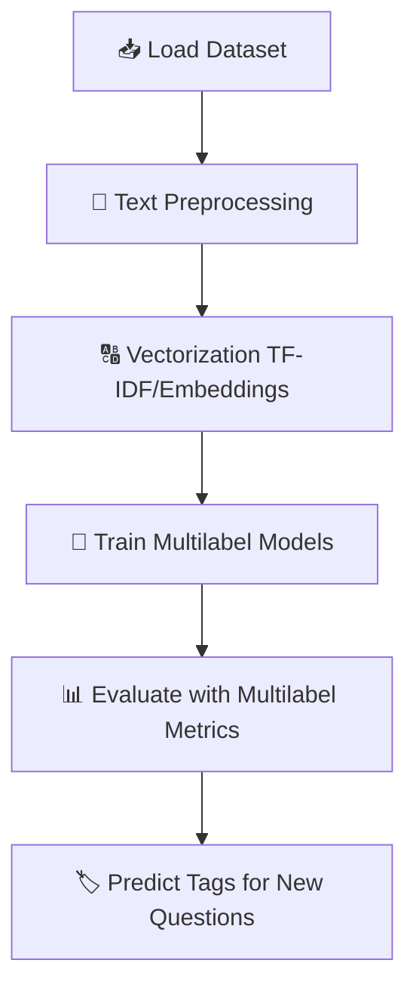

# Multilabel Text Classification with NLP

## 📌 Project Overview

This project, developed by **Nowa Analytics**, explores the application of **Natural Language Processing (NLP)** and **Machine Learning** techniques to classify **Stack Overflow questions** into multiple relevant tags.

Unlike traditional classification problems where each text belongs to a single category (**multiclass**), in this case a question can be associated with **multiple labels simultaneously** (**multilabel classification**).

For example, a question about Python and Machine Learning could be tagged with both **“python”** and **“machine-learning”**.

## 🎯 Objectives

* Understand the difference between **multilabel classification** and **multiclass classification**.
* Apply **multilabel classification** to Stack Overflow questions.
* Explore **evaluation metrics** specific to multilabel problems.
* Utilize **Scikit-Multilearn**, a Python library designed for multilabel classification.
* Build a robust text classification pipeline with NLP techniques.

## 🗂️ Business Context

Stack Overflow is one of the most important platforms for programmers and developers. Each question is tagged with one or more **labels** that describe the technologies, frameworks, or problems addressed.

Manually tagging these questions is time-consuming and error-prone. By applying **machine learning**, we can automate this process, improving **content organization**, **searchability**, and **user experience**.

## 📊 Dataset

The dataset contains a collection of **Stack Overflow questions** with the following structure:

* **Question Title & Body** – The text to be classified.
* **Tags (Labels)** – One or more tags that describe the content.

Examples of labels:

* `python`, `java`, `machine-learning`, `django`, `nlp`, `reactjs`, `sql`.

## ⚙️ Methodology

### 🔹 Machine Learning Pipeline

1. **Data Preprocessing**

   * Text cleaning (removing stopwords, punctuation, HTML tags).
   * Tokenization and lemmatization.
   * Transforming text into numerical vectors (TF-IDF, Word Embeddings).

2. **Modeling**

   * Applying **multilabel classification algorithms** such as:

     * Binary Relevance
     * Classifier Chains
     * MLkNN
   * Using **Scikit-Multilearn** and **Scikit-learn**.

3. **Evaluation Metrics**
   Since multilabel problems require specialized evaluation:

   * **Hamming Loss**
   * **Jaccard Similarity**
   * **F1-Score (micro/macro averaging)**

## 🔄 Project Pipeline

## 📈 Expected Results

* Automated classification of Stack Overflow questions into multiple relevant tags.
* Comparison of **different multilabel classification strategies**.
* Insights into **challenges of multilabel text classification**.
* A **portfolio-ready project** showcasing NLP and ML expertise.

## 👨‍💻 Authors

Project developed by **Nowa Analytics**
🚀 Data Science Consulting | Machine Learning Solutions

